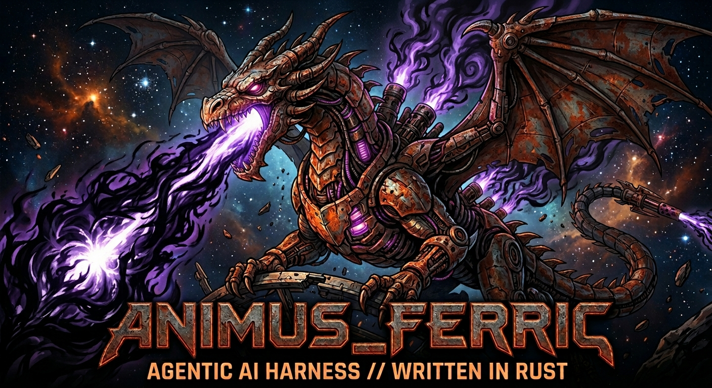

<p align="center">
  
</p>

# Animus Ferric

A local-first agentic coding harness written in Rust, purpose-built for **small local models (1B–14B GGUF)**.

Ferric is the Rust synthesis of the Animus lineage — [Animus](https://github.com/crussella0129/Animus) (Python), [Animus_Prion](https://github.com/crussella0129/Animus_Prion) (Go), and [fev](https://github.com/crussella0129/fev) (Go) — built on three convictions:

1. **The harness should own decoding.** Constrained generation (llguidance-style JSON-Schema/regex/CFG grammars) driven end-to-end in the agent loop, so malformed tool calls are impossible rather than repairable.
2. **Behavior should scale to the model, deterministically.** A pure function maps a model profile (params, quant, context, measured capability level) to a run policy (protocol, plan granularity, turn budgets, tool count). Small models get small steps.
3. **The trajectory is the source of truth.** Every session writes a versioned JSONL trace — full conversation, tool calls, untruncated tool output, execution chain — replayable and diffable. If it isn't in the trace, it didn't happen.

Rust is not an implementation detail: the visible, demonstrable chain of ownership over state and execution is part of how you verify you control the agent.

## Workspace

| Crate | Responsibility |
|---|---|
| `ferric-core` | Shared types + the deterministic scale function (ModelProfile → RunPolicy) |
| `ferric-trace` | Versioned TraceEvent schema, flush-per-event JSONL sink, tolerant reader |
| `ferric-provider` | Async `Provider` trait (constraint-carrying) + deterministic mock; real backends from s1 |
| `ferric-guard` | Hardcoded security: workspace boundary, permission checker, deny lists |
| `ferric-tools` | Tool trait, registry chokepoint, builtin file tools |
| `ferric-cli` | The `ferric` binary |

## Portability

CPU-first. The baseline target includes Raspberry Pi / Orange Pi class aarch64 hardware; CI gates `cargo check --target aarch64-unknown-linux-gnu`. CUDA (NVIDIA, Jetson) and AMD paths are planned as specialized backends.

## Status

Active development (sprint 8). Two inference backends ship behind feature flags:

- **`backend-mistralrs`** — in-process mistral.rs GGUF, driven text-only via the loop's `TextXml` protocol (its server-side constrained path hangs upstream; see ADR-020).
- **`backend-openai`** — an OpenAI-compatible HTTP valve (llama.cpp / Ollama / vLLM) that enforces a harness-authored JSON-Schema constraint server-side. This is the constrained-decoding thesis working for small GGUF models: out-of-process, with pure-Rust on Ferric's side.

The action protocol (`NativeTools` / `ConstrainedJson` / `TextXml`) is chosen from each backend's real capabilities. An embedded PyO3/PyTorch backend was tried and removed (ADR-021) — external engines are reached only via the out-of-process valve. Development follows a sprint-loop protocol; see `decisions.md` for ADRs and `agent-tasks/` for the ledger.

## First run — the testbench

Ferric works with large and small models alike, but *how well* a small model drives the tools varies. The testbench tells you: it runs every tool many times, classifies *why* it misses, and grades the result — so you can dial a model down until quality drops.

```sh
# 1. Bring up a local OpenAI-compatible server (llama.cpp by default; Ollama pluggable):
ferric server up --engine llama-server --model path/to/model.gguf
#    (multimodal: add --mmproj path/to/mmproj.gguf · or:  --engine ollama --model qwen2.5-coder:7b)

# 2. Benchmark tool-calling fire rate under the constrained path, and write a report:
ferric toolbench --backend openai --model <name> --protocol grammar --report report.md

# 3. Read report.md: per-tool success rate, a failure taxonomy
#    (wrong_tool / malformed_args / no_action / parse_error), and a verdict band
#    (solid >=90% / marginal >=70% / unreliable <70%). Try a smaller model and re-run.

ferric server down   # stop it when done
```

`ferric query` and `ferric toolbench` **auto-discover** the running server (no `--api-base` needed — it's read from `.ferric/server.json`). `ferric server doctor` checks your engine binary + model before you start. Full walkthrough: [docs/testbench.md](docs/testbench.md).
