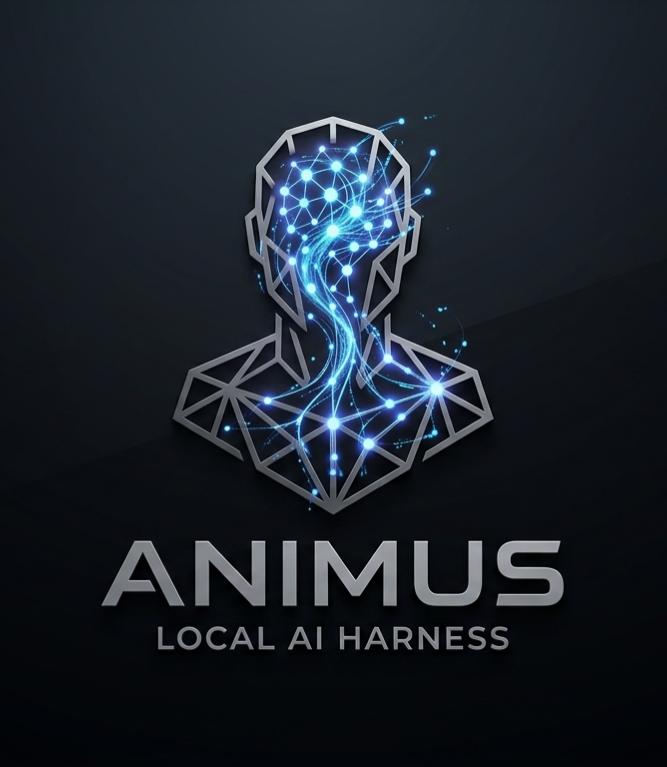

<p align="center">
  
</p>

# Animus Ferric

**Ferric is the Iron of [Animus Amalgam](https://github.com/crussella0129/Animus_Amalgam).**
Amalgam is the Animus Project's fork of Hermes Agent, the Mercury. It owns the
conversation, tools, memory, human surface and authorization. What Hermes lacks
entirely is harness-owned constrained decoding: the harness authors the action
grammar and the backend enforces it, so a malformed tool call cannot be
produced. Ferric supplies that part.

- **`ferric-iron`** is the constrained-decoding core. It covers action-grammar
  authoring from any tool list (including Hermes's OpenAI-format tools),
  action parsing, capability-honest protocol selection, and the protocol's
  prompt conventions. It depends only on serde and thiserror. It is not a
  decoder: the backend (llama.cpp) enforces the token mask.
- **`ferric-valve`** is an OpenAI-compatible service that Hermes's custom
  endpoint points at. It turns Hermes's native-tools request into one
  constrained action for llama.cpp, then turns the action back into ordinary
  `tool_calls` or a reply, so Hermes keeps its loop, tools and history
  unchanged. See [crates/ferric-valve](crates/ferric-valve/README.md).

| Ferric owns | Amalgam owns |
|---|---|
| The core, the valve, and component-level evidence about them | Hermes integration, session-level qualification, and whether each approach advances |

The design target is mid-size quantized GGUF models: roughly 20–35B at about
Q4, on a consumer GPU plus system RAM with partial offload. The reference model
is Qwen3.8-27B at Q4. Small models (1B–8B) remain the floor and the regression
fleet. Whether constrained decoding makes that class faster or more accurate
is being measured
([INT-0013](docs/intents/INT-0013-constrained-decoding-on-midsize-quantized-target.md)),
not assumed.

## The standalone assistant (maintenance)

Ferric's original standalone coding assistant still builds and works. It is in
maintenance: fixes are accepted, new features are not
([INT-0010](docs/intents/INT-0010-ferric-is-the-iron-of-amalgam.md)).

```sh
cargo r
```

From this repository, that opens a session in the current folder. Ferric asks
which model to use only when needed, then whether you want to ask questions or
allow file work. Type your question or task; `/quit` ends the session.

You need Rust and either an already configured model server, or an installed
`llama-server` plus an existing GGUF file in the workspace's `models` directory.
Ferric prepares the session and remembers the selected model. It does not
download engines or models. If resources are missing, it explains what to add.

## Everyday commands

| Command | What it does |
|---|---|
| `ferric run` | Open the same interactive session as `ferric` with no arguments. |
| `ferric status` | Describe configuration and available local resources. |
| `ferric explain` | Describe intended setup and ownership without probes or changes. |
| `ferric advanced` | Find the existing expert commands. |

For source execution, put arguments after `cargo r --`. For example,
`cargo r -- run --workspace ../my-project` selects another folder.
Without a terminal, no-argument launch prints a short welcome and exits without
starting anything.

Ask mode has no file tools. File work requires permission for the displayed
folder on each session, or an explicit `--allow-edits` flag:

```sh
ferric run "Explain Rust ownership"
ferric run --allow-edits "Add a unit test for the parser"
```

File work uses the Evidence controller with conservative, unmeasured tool
limits. It grants no shell, hooks, or delegation. Existing expert commands,
including `query`, `chat`, `server`, `bench`, and `trace`, remain available
under their original names and through `advanced`.

## Running the valve with Hermes

With a llama.cpp server already listening on port 8080:

```sh
cargo run -p ferric-valve -- --upstream http://127.0.0.1:8080 --receipts receipts.jsonl
```

Then point Hermes's custom provider at `http://127.0.0.1:8090/v1`.

- The valve refuses to start unless the upstream demonstrably enforces a JSON
  schema.
- It binds loopback only.
- It writes one content-free receipt per request.
- `--record-only` forwards every request unchanged while writing the same
  receipts, for a native comparison arm.

## What preparation guarantees

A newly started engine stays owned by the session and is stopped and reaped on
exit. A borrowed server stays running. Ambiguous registrations are reported
without deleting them or stopping someone else's process.

Local launch defaults to CPU execution and a 4096-token context. These are
starting settings, not a hardware-fit or model-capability qualification.
No benchmark is required before conversation, and readiness is not evidence
of successful coding work. Status and explain do not claim completed workflow
checkpoints or perform health probes.

Cancellation is bounded during startup and provider requests. During file work,
an existing Git snapshot operation can delay cancellation until Git returns;
this limitation remains open. Session traces stay in `.ferric/trace`.

## Install and configure

Normal builds include the OpenAI-compatible backend. To install the current
source on your PATH:

```sh
cargo install --path crates/ferric-cli --force
```

Reinstall after source changes; the installed copy is a snapshot. For a build
without a real backend, use `--no-default-features`; expert mock commands remain
available.

[Configuration](docs/configuration.md) explains saved defaults and their
validation. [Command reference](docs/commands.md) covers the full expert
surface. [Server configuration](docs/server-configuration.md) covers manually
managed engines and Tailscale. [Testbench](docs/testbench.md) covers measured
capability. See the [documentation index](docs/README.md) for architecture and
contributing details.

Ferric belongs to the [Animus lineage](https://github.com/crussella0129/Animus).
[Licensing information for all Animus Project components](https://github.com/crussella0129/Animus/blob/main/LICENSE).
